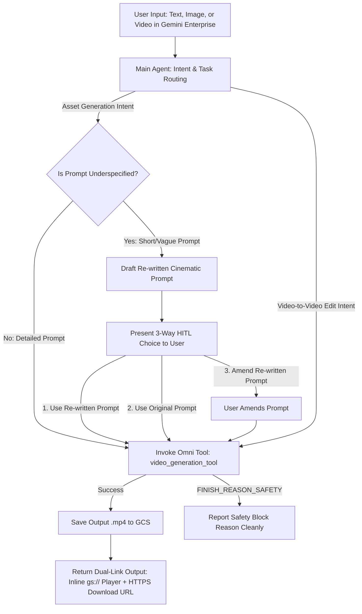

# SPEC.md — Gemini Enterprise Video Creation & Editing Agent (Omni-Agent)

## 1. Overview & Core Architecture

The **Omni-Agent** is an intelligent, intent-driven video creation and editing assistant built for **Gemini Enterprise App** users. It enables users to generate new videos from text or images and iteratively refine or edit existing videos through natural conversation.

### Architectural Separation of Concerns
The system separates high-level conversational reasoning from raw multimodal video generation:
* **Main Orchestration Agent:** Runs a fast reasoning model (`AGENT_MODEL_ID`, e.g., Gemini Flash 3.5 / Gemini 2.5 Flash). It handles user intent classification, conversational context, interactive prompt rewriting for video generation assets, and session state management (`previous_interaction_id`, `file_data_mappings`).
* **Video Generation & Editing Engine:** Powered exclusively by **Gemini Omni (`gemini-omni-flash-preview`)** via the Google GenAI Interactions API (`client.interactions.create(...)`). The main agent invokes Gemini Omni as a dedicated **Tool** (`video_generation_tool`).

---

## 2. Environment & Configuration (Zero Hardcoding)

All runtime parameters, model identifiers, and infrastructure settings must be externalized and loaded dynamically from an environment configuration file (`.env`). No values may be hardcoded in application source code.

| Environment Variable | Required | Default Value | Description |
| :--- | :--- | :--- | :--- |
| `GOOGLE_CLOUD_PROJECT` | Yes | — | Google Cloud Project ID for execution and API billing. |
| `GOOGLE_CLOUD_REGION` | Yes | `global` | Region for GenAI API endpoints and execution (`global`). |
| `AGENT_MODEL_ID` | Yes | `gemini-2.5-flash` (or configured Flash 3.5 string) | Model identifier for the primary orchestration/reasoning agent. |
| `OMNI_MODEL_ID` | Yes | `gemini-omni-flash-preview` | Model identifier for the Gemini Omni video generation/editing tool. |
| `GCS_BUCKET_NAME` | Yes | — | GCS bucket name (`gs://<bucket>`) for input/output video and image artifacts. |

---

## 3. Core Functional Workflow & Prompt Rewriting Gate



### 3.1 Intent-Driven Routing
The Main Agent automatically detects user intent from input modalities and conversation context without requiring explicit menu wizards:
* **Text-to-Video (`text_to_video`):** User provides text description for asset generation.
* **Image-to-Video (`image_to_video`):** User attaches a reference image (`FileData`) and describes desired motion.
* **Reference-to-Video (`reference_to_video`):** User attaches subject reference images.
* **Video-to-Video / Stateful Edit (`edit`):**
  * *Follow-up turn:* Uses stored `previous_interaction_id` to refine the previously generated video.
  * *Uploaded file:* Resolves GCS URI (`gs://...`) for uploaded user video and applies prompt instructions.

### 3.2 Asset Generation Prompt Rewriting Gate (HITL)
When the user requests **asset creation/generation** (`text_to_video`, `image_to_video`, `reference_to_video`), the Main Agent inspects prompt detail across subject, camera movement, and lighting:
* **Detailed Prompt:** Invokes `video_generation_tool` immediately (zero-friction execution).
* **Underspecified Prompt:** Intercepts execution and presents an interactive prompt-rewrite loop:
  1. Explains what would make the prompt stronger (e.g., camera motion, lighting).
  2. Displays an enriched, professional **Re-written Prompt**.
  3. Presents a **3-Way Choice**:
     * **Option 1 (Recommended):** Proceed with Re-written Prompt.
     * **Option 2 (Override):** Proceed with Original Prompt.
     * **Option 3 (Amend):** Modify or tweak the Re-written Prompt.

*(Note: Formal numeric prompt evaluation scoring is deferred for v1; rewriting is focused specifically on asset generation prompts.)*

---

## 4. Tool Interface & Input/Output Architecture

### 4.1 Explicit Typed Tool Signature (`video_generation_tool`)
The Main Agent calls `video_generation_tool` with an explicit, strongly typed parameter signature:
```python
def video_generation_tool(
    prompt: str,
    task: str,  # "text_to_video", "image_to_video", "reference_to_video", or "edit"
    aspect_ratio: str = "16:9",  # "16:9" (default landscape) or "9:16" (portrait)
    file_uris: list[str] | None = None,  # Resolved GCS URIs (gs://...) for reference files
    previous_interaction_id: str | None = None,  # Multi-turn conversational edit state
    tool_context: ToolContext = None,
) -> str:
    ...
```

### 4.2 Ingestion & `FileDataResolverPlugin`
* **Uploaded Files (`FileData`):** An ADK plugin (`FileDataResolverPlugin`) intercepts uploaded Gemini Enterprise files (`FileData` parts with `gs://...`) and records `filename -> gs://...` mappings in `session.state["file_data_mappings"]`.
* **Stateful Conversational Editing:** When an interaction completes, `interaction.id` is saved in ADK session state as `previous_interaction_id`. Follow-up edit requests reuse this ID without re-uploading source files. Users can explicitly reset state (`previous_interaction_id = None`) by requesting a *"New video"* or *"Start over"*.

### 4.3 Output Artifact Delivery
When `client.interactions.create(...)` returns base64 `output_video.data`:
1. The tool writes the binary `.mp4` artifact to the configured GCS bucket (`gs://<GCS_BUCKET_NAME>/artifacts/<uuid>.mp4`).
2. The tool returns **both**:
   * **Inline Video Player Markdown (`gs://...`):** Native format recognized by Gemini Enterprise chat UI to render an interactive HTML5 video player (``).
   * **Authenticated HTTPS Download Link (`https://storage.cloud.google.com/...`):** Direct browser-accessible URL enabling users to download or share the generated `.mp4`.

---

## 5. Safety & Enterprise Policy Guardrails

* **Transparent Safety Reporting:** If Gemini Omni rejects an input or prompt due to safety filters (`FINISH_REASON_SAFETY` or API policy exception), the agent cleanly reports the rejection reason to the user without auto-retry or speculation.
* **No Artificial Style Enforcement:** The agent does not inject artificial corporate watermarks, style disclaimers, or unrequested prompt modifiers.

---

## 6. Lifecycle & Tooling (`google-agents-cli-*`)

The project lifecycle conforms strictly to standard Agent CLI (`google-agents-cli-*`) skills and workflows:
* **Scaffolding (`google-agents-cli-scaffold`):** Standard ADK structure (`app/`, `tests/`).
* **Development (`google-agents-cli-adk-code`):** Clean separation between agent orchestration prompt (`AGENT_MODEL_ID`) and tools (`OMNI_MODEL_ID`).
* **Evaluation & Testing (`google-agents-cli-eval`):** Verification against standard Critical User Journeys.
* **Deployment (`google-agents-cli-deploy`):** Container / runtime packaging configured via environment injection (`.env`).

---

## 7. Critical User Journeys (CUJs) & Verification Criteria

| CUJ ID | Journey Name | Execution Step | Expected Verification Outcome |
| :--- | :--- | :--- | :--- |
| **CUJ-1** | **Text-to-Video Generation** | User inputs descriptive prompt (`16:9`). | Main Agent invokes `video_generation_tool` (`text_to_video`); saves `.mp4` to GCS; returns inline `gs://` player + HTTPS download link. |
| **CUJ-2** | **Image-to-Video Animation** | User uploads GCS image + prompt *"Animate camera push in"*. | `FileDataResolverPlugin` resolves GCS URI; invokes `video_generation_tool` (`image_to_video`); returns dual-link output. |
| **CUJ-3** | **Iterative Stateful Edit** | After CUJ-1, user asks *"Make the lighting sunset golden hour"*. | Agent passes `previous_interaction_id` to `video_generation_tool` (`edit`); returns modified video dual-link. |
| **CUJ-4** | **Uploaded Video Edit** | User uploads existing `.mp4` + prompt *"Add cinematic zoom"*. | Agent passes GCS document URI to `video_generation_tool` (`edit`); returns dual-link output. |
| **CUJ-5** | **Asset Prompt Rewrite Gate** | User requests asset generation with brief prompt *"make a car video"*. | Main Agent intercepts; presents enriched rewrite + 3-way HITL choice (*Re-written / Original / Amend*). |
| **CUJ-6** | **Safety Block Handling** | User enters prompt triggering `FINISH_REASON_SAFETY`. | Tool captures API exception and reports exact safety feedback cleanly without retrying or crashing. |
