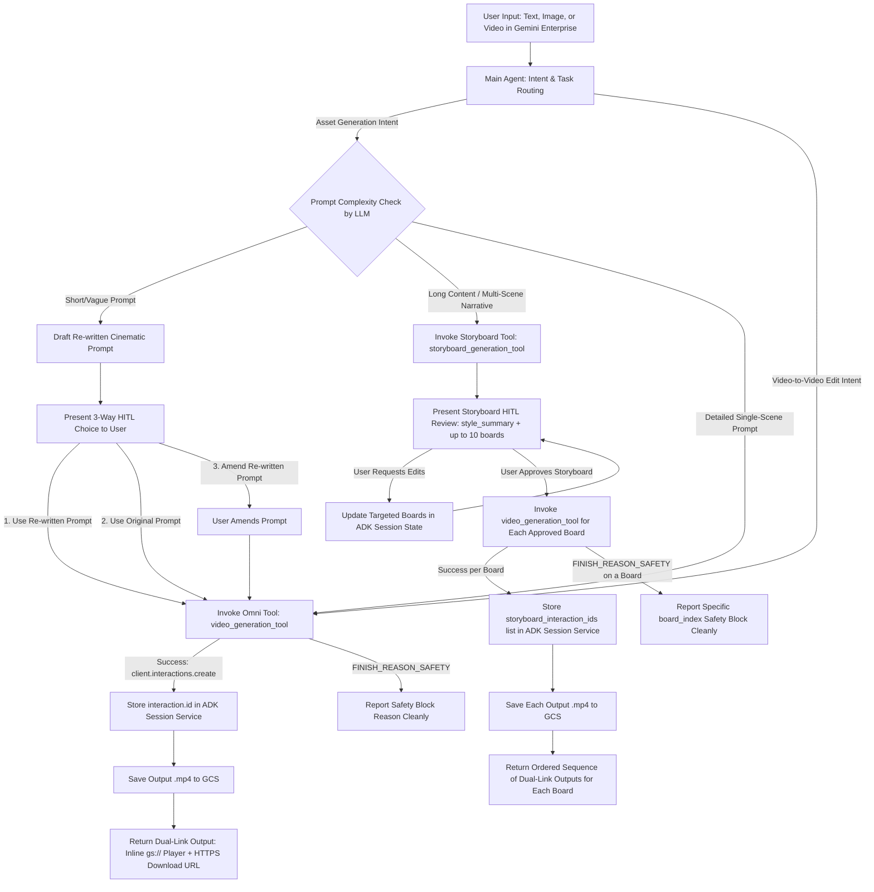

# SPEC.md — Gemini Enterprise Video Creation & Editing Agent (Omni-Agent)

## 1. Overview & Core Architecture

The **Omni-Agent** is an intelligent, intent-driven video creation and editing assistant built for **Gemini Enterprise App** users. It enables users to generate new videos from text or images and iteratively refine or edit existing videos through natural conversation.

### Architectural Separation of Concerns
The system separates high-level conversational reasoning from raw multimodal video generation:
* **Main Orchestration Agent:** Runs a fast reasoning model (`AGENT_MODEL_ID`, e.g., Gemini Flash 3.5 / Gemini 2.5 Flash). It handles user intent classification, conversational context, interactive prompt rewriting for short/vague video generation prompts, long-content storyboard decomposition, style gate prompting, and session state orchestration (`file_data_mappings`, `storyboard_interaction_ids`, `active_style_markdown`).
* **Storyboard Generation Engine:** Powered by **Gemini Flash 3.6 (`STORYBOARD_MODEL_ID` / `gemini-3.6-flash`)**. Invoked as a dedicated **Tool** (`storyboard_generation_tool`) when analyzing long or multi-scene narrative prompts on the first prompt to decompose them into consistent, editable storyboards.
* **Video Generation & Editing Engine:** Powered exclusively by **Gemini Omni (`gemini-omni-flash-preview`)** via the Google GenAI Interactions API (`client.interactions.create(...)`). The main agent invokes Gemini Omni as a dedicated **Tool** (`video_generation_tool`).
* **Session State & Long-Term Memory (Agent Platform AI Sessions & Memory Bank):**
  * Uses **Agent Platform AI Sessions (`VertexAiSessionService`)** for persistent multi-turn state across conversation turns and sessions.
  * Uses **Vertex AI Agent Engine Memory Bank (`VertexAiMemoryBankService`)** so the agent remembers any specific styling that has been added by the user across sessions and can suggest the latest 3 styles.

---

## 2. Environment & Configuration (Zero Hardcoding)

All runtime parameters, model identifiers, and infrastructure settings must be externalized and loaded dynamically from an environment configuration file (`.env`). No values may be hardcoded in application source code.

| Environment Variable | Required | Default Value | Description |
| :--- | :--- | :--- | :--- |
| `GOOGLE_CLOUD_PROJECT` | Yes | — | Google Cloud Project ID for execution and API billing. |
| `GOOGLE_CLOUD_REGION` | Yes | `global` | Region for GenAI API endpoints and execution (`global`). |
| `AGENT_MODEL_ID` | Yes | `gemini-2.5-flash` (or configured Flash 3.5 string) | Model identifier for the primary orchestration/reasoning agent. |
| `STORYBOARD_MODEL_ID` | Yes | `gemini-3.6-flash` | Model identifier for the Storyboard analysis and decomposition tool (`storyboard_generation_tool`). |
| `OMNI_MODEL_ID` | Yes | `gemini-omni-flash-preview` | Model identifier for the Gemini Omni video generation/editing tool. |
| `GCS_BUCKET_NAME` | Yes | — | GCS bucket name (`gs://<bucket>`) for input/output video and image artifacts. |
| `VERTEX_AI_AGENT_ENGINE_ID` | No | — | Vertex AI Agent Engine ID for Agent Platform AI Sessions and Memory Bank persistence (`agentengine://<id>`). |
| `SESSION_SERVICE_URI` | No | `agentengine://<id>` or in-memory | URI for ADK Session Service persistence. |
| `MEMORY_SERVICE_URI` | No | `agentengine://<id>` or in-memory | URI for ADK Memory Bank service persistence. |

---

## 3. Core Functional Workflow, Prompt Rewriting Gate & Storyboard Decomposition


```mermaid
flowchart TD
    A[User Input: Text, Image, or Video in Gemini Enterprise] --> B[Main Agent: Intent & Task Routing]
    B -->|Asset Generation Intent| C{Prompt Complexity Check by LLM}
    
    C -->|Short/Vague Prompt| E[Draft Re-written Cinematic Prompt]
    E --> F[Present 3-Way HITL Choice to User]
    F -->|1. Use Re-written Prompt| D[Invoke Omni Tool: video_generation_tool]
    F -->|2. Use Original Prompt| D
    F -->|3. Amend Re-written Prompt| G[User Amends Prompt] --> D
    
    C -->|Long Content / Multi-Scene Narrative| L[Invoke Storyboard Tool: storyboard_generation_tool]
    L --> M[Present Storyboard HITL Review: style_summary + up to 10 boards]
    M -->|User Requests Edits| N[Update Targeted Boards in ADK Session State] --> M
    M -->|User Approves Storyboard| O[Invoke video_generation_tool for Each Approved Board]
    
    C -->|Detailed Single-Scene Prompt| D
    B -->|Video-to-Video Edit Intent| D
    
    D -->|Success: client.interactions.create| H[Store interaction.id in ADK Session Service]
    O -->|Success per Board| P[Store storyboard_interaction_ids list in ADK Session Service]
    H --> I[Save Output .mp4 to GCS]
    P --> Q[Save Each Output .mp4 to GCS]
    D -->|FINISH_REASON_SAFETY| J[Report Safety Block Reason Cleanly]
    O -->|FINISH_REASON_SAFETY on a Board| R[Report Specific board_index Safety Block Cleanly]
    
    I --> K[Return Dual-Link Output: Inline gs:// Player + HTTPS Download URL]
    Q --> S[Return Ordered Sequence of Dual-Link Outputs for Each Board]
```

### 3.1 Intent-Driven Routing
The Main Agent automatically detects user intent from input modalities and conversation context without requiring explicit menu wizards:
* **Text-to-Video (`text_to_video`):** User provides text description for asset generation.
* **Image-to-Video (`image_to_video`):** User attaches a reference image (`FileData`) and describes desired motion.
* **Reference-to-Video (`reference_to_video`):** User attaches subject reference images.
* **Storyboard Generation (`storyboard`):** On the first prompt, if the LLM detects long content or a multi-scene narrative, it routes to `storyboard_generation_tool` instead of the Prompt Rewriting Gate.
* **Video-to-Video / Stateful Edit (`edit`):**
  * *Follow-up turn:* `video_generation_tool` reads stored `previous_interaction_id` directly from the **ADK Session Service** to refine the previously generated video.
  * *Uploaded file:* Resolves GCS URI (`gs://...`) for uploaded user video and applies prompt instructions.
* **Video Extension (`extend_video`) — [NOT YET IMPLEMENTED]:**
  * Identifies intent to extend a video, either by taking a recently created video (via `previous_interaction_id`) or an uploaded video file (via GCS URI). Blocked by pending API support.

### 3.2 Asset Generation Prompt Rewriting Gate (HITL)
When the user requests **single-scene asset creation/generation** (`text_to_video`, `image_to_video`, `reference_to_video`), the Main Agent inspects prompt detail across subject, camera movement, and lighting:
* **Detailed Prompt:** Invokes `video_generation_tool` immediately (zero-friction execution).
* **Underspecified Prompt:** Intercepts execution and presents an interactive prompt-rewrite loop:
  1. Explains what would make the prompt stronger (e.g., camera motion, lighting).
  2. Displays an enriched, professional **Re-written Prompt**.
  3. Presents a **3-Way Choice**:
     * **Option 1 (Recommended):** Proceed with Re-written Prompt.
     * **Option 2 (Override):** Proceed with Original Prompt.
     * **Option 3 (Amend):** Modify or tweak the Re-written Prompt.

### 3.3 Long-Content Storyboard Decomposition (HITL Review Loop)
When the user inputs **long content or a multi-scene narrative** on the first prompt, the Main Agent dynamically routes to the Storyboard Tool (`storyboard_generation_tool`) powered by **Gemini Flash 3.6 (`STORYBOARD_MODEL_ID`)**, bypassing the Prompt Rewriting Gate:
* **Content Decomposition & Summarization:** The tool analyzes the prompt and breaks it down into a structured sequence of storyboards suitable for individual video clips of up to 10 seconds each.
* **Creative Storyboard Directives:**
  1. *No Broadcast / Newsroom Simulation:* Never simulate live newsrooms, broadcast anchors, virtual sets, or synthetic news hosts. Translate news, articles, or reports into cinematic visual metaphors, scientific animations, or architectural visualizations.
  2. *Optimal Board Count & Summarization:* If the user specifies a specific number of boards (or by default up to 10), summarize the content so it fits naturally within that number without padding or stretching to 10.
  3. *No Repetition:* Ensure no visual scenes, concepts, or narrative statements are repeated across boards.
  4. *Continuous Flow:* Maintain seamless visual and chronological continuity between boards.
* **Storyboard Schema:** The tool returns a structured JSON object and stores it in the ADK Session Service (`tool_context.session.state["current_storyboard"]`):
  * `title`: Title of the video storyboard project.
  * `overall_video_creation_plan`: Detailed plan explaining how the overall video is going to be created (visual aesthetic, pacing, camera choreography, lighting style, and audio design across all boards).
  * `style_summary`: A concise summary of the determined, consistent visual style across all boards (e.g., color palette, lighting aesthetic, camera tone).
  * `boards`: An array of up to 10 board objects, each containing:
    * `board_index`: 1-indexed sequence identifier (`1` to `10`).
    * `duration_seconds`: Target duration for the video clip (`<= 10.0`).
    * `visual_representation`: Comprehensive visual scene description (subject, environment, atmosphere).
    * `camera_movement`: Specific camera motion and cinematography.
    * `lighting_and_color`: Specific lighting setup, time of day, and color grading.
    * `narrative`: Exact voiceover, dialogue, or script narrative to be used.
    * `audio_and_sound_effects`: Sound effects, ambient audio, or music cues.
    * `transition_to_next`: How this board visually transitions to the next board.
* **Interactive Storyboard Review (HITL):**
  1. The Main Agent presents the generated storyboard back to the user:
     * Summarizes `title`, `overall_video_creation_plan`, and `style_summary` at the top of the response so global creation and style aspects are clearly visible without repeating across every board.
     * Displays a clean, scannable summary of each board's key editable parts (`board_index`, `duration_seconds`, `visual_representation`, `camera_movement`, `lighting_and_color`, `narrative`, `audio_and_sound_effects`).
  2. Asks the user if there is anything they would like to change on any board.
  3. **Targeted State Update Loop:** If the user requests modifications (e.g., *"Make board 3 sunset and remove board 7"*), the Main Agent updates the targeted boards in `tool_context.session.state["current_storyboard"]` without regenerating unchanged boards, presenting the updated storyboard summary for confirmation.
* **Multi-Video Execution & V4 Signed URLs:** Once the user approves the storyboard, the Main Agent invokes `generate_storyboard_videos_tool`, which automatically loops through each storyboard board in `current_storyboard` and creates an individual video clip for each board using Gemini Omni. Each video displays a sequence header (`### 🎬 Video X of Y | Board X`) and an authenticated **V4 Signed Download URL** valid for 7 days.
* **FFMPEG Video Merging (`merge_storyboard_videos_tool`):** At the end of multi-video generation, the tool asks if the user wants to merge all the video clips together into a single continuous video in sequence order. If the user replies yes (`"Yes, merge them"` / `/merge`), the Main Agent invokes `merge_storyboard_videos_tool()`, which uses `ffmpeg` (`-c copy` with automatic re-encoding fallback) to stitch all board `.mp4` clips together in chronological order and returns the full merged video player and V4 signed download link.

### 3.4 Style Gate, Memory Bank Suggestions & Clean-Text Injection (HITL)
Before creating a new video or storyboard, the Main Agent checks if the user wants to apply a specific visual style:
1. **Triggering Scope & Session Persistence:**
   * The Style Gate applies to **all new asset creation projects** (both single-scene video generation and multi-scene storyboards).
   * Once a style is chosen (or declined), it is persisted in the ADK Session Service state (`tool_context.session.state["active_style_name"]`, `tool_context.session.state["active_style_markdown"]`) and automatically reused across all follow-up turns in that session without reprompting.
2. **Memory Bank Retrieval & Suggestions:**
   * The agent queries **Vertex AI Agent Engine Memory Bank** (`tool_context.search_memory`) for previously saved styles.
   * **If styles exist in Memory Bank:** The agent suggests up to the **latest 3 saved styles** (by name, e.g., *"Google Branding"*, *"Cinematic Dark"*, etc.) and asks if the user wants to use one of them, provide a new Markdown style, or proceed without a specific style (*"no"*).
   * **If no styles exist in Memory Bank:** The agent asks if the user wants a specific style before creating the video. The user can say *"no"* or paste Markdown providing the style guidelines.
3. **Naming & Remembering Styles in Memory Bank:**
   * When a user pastes a Markdown style, the agent asks for a concise name (e.g., *"Google Branding"*), auto-generating a name via LLM summarization if left blank.
   * The style is saved to Memory Bank (`tool_context.add_memory(memories=[...])`) as an explicit `MemoryEntry` containing both the Style Name and full Markdown content, tagged with custom metadata `{"type": "video_style", "style_name": name}`, enabling zero-friction suggestion and retrieval across future sessions.
4. **Style Prompt & Clean-Text Guardrail Injection:**
   * When an active style is present, its Markdown text and the mandatory clean-text guardrail are **appended at the very end of the prompt** sent to Gemini Omni for both single-scene video generation (`video_generation_tool`) and every board in multi-video storyboard generation (`generate_storyboard_videos_tool`).
   * **MANDATORY Clean-Text Guardrail Block:** Alongside the style Markdown, the agent ALWAYS injects the following instruction block immediately after the style to prevent style metadata from rendering as text on screen:
```
Important:
The ONLY text that should appear anywhere in this video is what's specified in the storyboard.
Do not render any style guidelines, color names, hex codes, RGB values, or instructional metadata as text in the video itself. Keep all graphic elements and callout boxes completely clean of any technical prompts.
```

---

## 4. Tool Interface & ADK Session Service State Architecture

### 4.1 Storyboard Tools Signatures (`storyboard_generation_tool`, `update_storyboard_tool`, `generate_storyboard_videos_tool`)
The Main Agent calls the storyboard tools with explicit parameter signatures:
```python
def storyboard_generation_tool(
    prompt: str,
    max_boards: int = 10,
    tool_context: ToolContext = None,
) -> dict:
    ...

def update_storyboard_tool(
    board_index: int = None,
    visual_representation: str = None,
    camera_movement: str = None,
    lighting_and_color: str = None,
    narrative: str = None,
    audio_and_sound_effects: str = None,
    duration_seconds: float = None,
    style_summary: str = None,
    overall_video_creation_plan: str = None,
    tool_context: ToolContext = None,
) -> dict:
    ...

def generate_storyboard_videos_tool(
    aspect_ratio: str = "16:9",
    tool_context: ToolContext = None,
) -> str:
    ...
```

### 4.2 Explicit Typed Tool Signature (`video_generation_tool`)
The Main Agent calls `video_generation_tool` with an explicit, strongly typed parameter signature:
```python
def video_generation_tool(
    prompt: str,
    task: str,  # "text_to_video", "image_to_video", "reference_to_video", "edit", or "extend_video"
    aspect_ratio: str = "16:9",  # "16:9" (default landscape) or "9:16" (portrait)
    file_uris: list[str] | None = None,  # Resolved GCS URIs (gs://...) for reference files
    tool_context: ToolContext = None,
) -> str:
    ...
```

### 4.3 ADK Session Service Interaction ID & Storyboard Persistence
Every time `video_generation_tool` or `storyboard_generation_tool` executes:
* **Storyboard State Storage (`ADK Session Service`):** `storyboard_generation_tool` stores the generated or edited storyboard in `tool_context.session.state["current_storyboard"]`.
* **Single-Video Interaction ID Storage (`ADK Session Service`):** The GenAI Interactions API returns a unique Interaction ID (`interaction.id`, e.g., `"v1_..."`). The tool explicitly stores this Interaction ID in **`tool_context.session.state["previous_interaction_id"] = interaction.id`**.
* **Multi-Video Storyboard Interaction IDs (`ADK Session Service`):** When generating videos from an approved storyboard, the Main Agent stores the ordered list of generated Interaction IDs in **`tool_context.session.state["storyboard_interaction_ids"]`**, allowing subsequent turn edits to target specific boards by index.
* **Stateful Conversational Editing:** When `task == "edit"` and `tool_context.session.state.get("previous_interaction_id")` is present, the tool automatically retrieves `tool_context.session.state["previous_interaction_id"]` and passes it to `client.interactions.create(..., previous_interaction_id=previous_interaction_id)` to modify the video without re-uploading source files.
* **State Reset:** Users can explicitly reset the state (`tool_context.session.state["previous_interaction_id"] = None`, `tool_context.session.state["current_storyboard"] = None`) by requesting a *"New video"* or *"Start over"*.

### 4.4 Output Artifact Delivery
When `client.interactions.create(...)` completes and stores interaction state in the ADK Session Service:
1. The tool writes the binary `.mp4` artifact (`output_video.data`) to the configured GCS bucket (`gs://<GCS_BUCKET_NAME>/artifacts/<uuid>.mp4`).
2. For single videos or each board in an approved storyboard, the tool returns **both**:
   * **Inline Video Player Markdown (`gs://...`):** Native format recognized by Gemini Enterprise chat UI to render an interactive HTML5 video player (``).
   * **Authenticated HTTPS Download Link (`https://storage.cloud.google.com/...`):** Direct browser-accessible URL enabling users to download or share the generated `.mp4`.
3. In multi-video storyboard executions, the Main Agent displays the ordered sequence of inline video players and HTTPS download links corresponding to each storyboard board index.

### 4.5 Agent Platform AI Sessions & Memory Bank Architecture
The system integrates Google ADK Session and Memory services for persistence:
* **Persistent Multi-Turn Sessions (`VertexAiSessionService`):** Session state (`previous_interaction_id`, `current_storyboard`, `storyboard_interaction_ids`, `active_style_name`, `active_style_markdown`) is persisted in Agent Platform AI Sessions using the URI `agentengine://<VERTEX_AI_AGENT_ENGINE_ID>`.
* **Long-Term Style Memory (`VertexAiMemoryBankService`):** Custom user styles are stored as structured memory entries via `tool_context.add_memory(...)`. When starting a task, the agent retrieves recent style memories (`tool_context.search_memory`) to offer the latest 3 styles.

---

## 5. Safety & Enterprise Policy Guardrails

* **Transparent Safety Reporting:** If Gemini Omni rejects an input or prompt due to safety filters (`FINISH_REASON_SAFETY` or API policy exception), the agent cleanly reports the rejection reason to the user without auto-retry or speculation. In storyboard multi-video execution, if a specific board triggers `FINISH_REASON_SAFETY`, the agent reports the exact `board_index` safety block clearly while preserving successful clips.
* **No Artificial Style Enforcement:** The agent does not inject artificial corporate watermarks, style disclaimers, or unrequested prompt modifiers.

---

## 6. Lifecycle & Tooling (`google-agents-cli-*`)

The project lifecycle conforms strictly to standard Agent CLI (`google-agents-cli-*`) skills and workflows:
* **Scaffolding (`google-agents-cli-scaffold`):** Standard ADK structure (`app/`, `tests/`).
* **Development (`google-agents-cli-adk-code`):** Clean separation between agent orchestration prompt (`AGENT_MODEL_ID`), storyboard analysis (`STORYBOARD_MODEL_ID`), and tools (`OMNI_MODEL_ID`).
* **Evaluation & Testing (`google-agents-cli-eval`):** Verification against standard Critical User Journeys.
* **Deployment (`google-agents-cli-deploy`):** Container / runtime packaging configured via environment injection (`.env`).

---

## 7. Critical User Journeys (CUJs) & Verification Criteria

| CUJ ID | Journey Name | Execution Step | Expected Verification Outcome |
| :--- | :--- | :--- | :--- |
| **CUJ-1** | **Text-to-Video Generation** | User inputs descriptive prompt (`16:9`). | Main Agent invokes `video_generation_tool` (`text_to_video`); stores `interaction.id` in ADK Session Service; saves `.mp4` to GCS; returns inline `gs://` player + HTTPS download link. |
| **CUJ-2** | **Image-to-Video Animation** | User uploads local test image (`tests/fixtures/sample_image.png` from Nano Banana 2) + prompt *"Animate camera push in"*. | Local file uploaded; `FileDataResolverPlugin` resolves GCS URI; invokes `video_generation_tool` (`image_to_video`); stores `interaction.id` in ADK Session Service; returns dual-link output. |
| **CUJ-3** | **Iterative Stateful Edit** | After CUJ-1, user asks *"Make the lighting sunset golden hour"*. | Tool automatically reads `previous_interaction_id` from ADK Session Service (`tool_context.session.state`) and passes it to `client.interactions.create` (`edit`); updates ADK Session Service with new `interaction.id`; returns modified video dual-link. |
| **CUJ-4** | **Uploaded Video Edit** | User uploads local test video (`tests/fixtures/sample_video.mp4` from Veo 3) + prompt *"Add cinematic zoom"*. | Local file uploaded; Agent passes resolved cloud URI to `video_generation_tool` (`edit`); stores `interaction.id` in ADK Session Service; returns dual-link output. |
| **CUJ-5** | **Asset Prompt Rewrite Gate** | User requests asset generation with brief prompt *"make a car video"*. | Main Agent intercepts; presents enriched rewrite + 3-way HITL choice (*Re-written / Original / Amend*). |
| **CUJ-6** | **Safety Block Handling** | User enters prompt triggering `FINISH_REASON_SAFETY`. | Tool catches API exception and reports exact safety feedback cleanly without retrying or crashing. |
| **CUJ-7** | **Video Extension (Not Implemented)** | User uploads a video or asks to extend their recently generated video (e.g., *"Make this 5 seconds longer"*). | Main Agent invokes `video_generation_tool` (`extend_video`), handling either an uploaded file or the `previous_interaction_id`. *(Note: Pending API support).* |
| **CUJ-8** | **Long-Content Storyboard to Multi-Video Generation** | User inputs a long or multi-scene narrative prompt on first prompt. | Main Agent dynamically routes to `storyboard_generation_tool` (`STORYBOARD_MODEL_ID`); breaks prompt down into up to 10 boards (`title`, `overall_video_creation_plan`, `style_summary`, and per-board cinematography, lighting, narrative, and audio cues, obeying directives against broadcast newsroom simulation and for optimal board counts); stores storyboard in ADK Session Service; presents comprehensive HITL review summary; user modifies a board or approves; Main Agent invokes `generate_storyboard_videos_tool`, which loops through each approved board to create an individual video clip (`video_generation_tool`) with V4 signed download URLs, stores `storyboard_interaction_ids` in ADK Session Service, and asks if user wants to merge them; if yes, `merge_storyboard_videos_tool()` merges clips in sequence order using `ffmpeg` and returns the full video. |
| **CUJ-9** | **Memory Bank Style Gate & Clean-Text Video Injection** | User asks to create a video/storyboard. Agent checks Memory Bank and suggests latest 3 styles (or asks if user wants a style). User pastes Markdown style guidelines and names it *"Google Branding"*. | Named style is saved to Memory Bank via ADK `add_memory`; active style Markdown and mandatory `"Important: The ONLY text that should appear anywhere in this video..."` clean-text guardrail are appended to the prompt for Omni video generation. |
